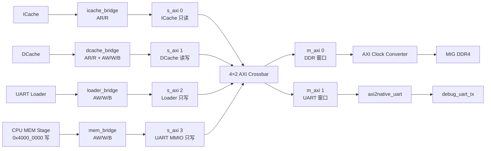

# 5Pipeline AXI 互连设计说明

本文根据当前 `5pipeline` 文件夹中的硬件源码整理，说明本设计的 AXI 功能、Bridge 实现、地址映射、Crossbar 仲裁、ID 路由、DDR 时钟域转换以及 UART MMIO 写通路。

参考查看的 GitHub 项目：https://github.com/fpganinja/taxi

## 1. 设计目标与总体结构

本设计用一个 **4 个发起端、2 个目标端** 的 AXI4 Crossbar，把处理器取指、数据访问、Loader 下载和 CPU 调试串口写请求连接到 DDR4 与 UART 两个目标端。



顶层接口槽位来自 [`soc_top.sv`](soc_top.sv)：

```systemverilog
taxi_axi_if #(
    .DATA_W (32),
    .ADDR_W (32),
    .ID_W   (`AXI_S_ID_WIDTH)
) s_axi [4] ();

taxi_axi_if #(
    .DATA_W (32),
    .ADDR_W (30),
    .ID_W   (`AXI_M_ID_WIDTH)
) m_axi [2] ();
```

各输入槽位在 [`bridge_top.sv`](axi/bridge/bridge_top.sv) 和 [`soc_top.sv`](soc_top.sv) 中固定为：

| Crossbar 输入 | 发起模块          | 使用通道        | 主要功能                                |
| ------------- | ----------------- | --------------- | --------------------------------------- |
| `s_axi[0]`  | `icache_bridge` | AR、R           | ICache miss 时从 DDR 读取一条 32 位指令 |
| `s_axi[1]`  | `dcache_bridge` | AR、R、AW、W、B | DCache miss 读、write-through 写        |
| `s_axi[2]`  | `loader_bridge` | AW、W、B        | Loader 把 IMEM/DMEM 镜像写入 DDR        |
| `s_axi[3]`  | `mem_bridge`    | AW、W、B        | CPU 向调试 UART 发送一个字节            |

Crossbar 输出固定为：

| Crossbar 输出 | 目标模块                   | 使用通道     | 主要功能                                      |
| ------------- | -------------------------- | ------------ | --------------------------------------------- |
| `m_axi[0]`  | AXI Clock Converter → MIG | 完整读写通道 | 访问 DDR4                                     |
| `m_axi[1]`  | `axi2native_uart`        | AW、W、B     | 把 AXI 单字节写转换为 UART native valid/ready |

未使用通道在 `soc_top.sv` 中固定为 0。例如 ICache 的写通道、Loader 和 UART 主机的读通道均被关闭。UART 目标端当前也没有实现 AXI 读响应。

## 2. AXI Crossbar 的开源参考与许可

本地 `axi/axi_crossbar` 下的模块采用 `taxi_*` 命名，文件头标有：

```systemverilog
// SPDX-License-Identifier: CERN-OHL-S-2.0
/*

Copyright (c) 2018-2025 FPGA Ninja, LLC

Authors:
- Alex Forencich

*/
```

因此，本设计的 AXI Crossbar 实现借鉴并使用了 FPGA Ninja 的 **Taxi Transport Library** 中 AXI Crossbar 的组织方式：

- Taxi GitHub 仓库：[https://github.com/fpganinja/taxi](https://github.com/fpganinja/taxi)
- Taxi AXI RTL 目录：[https://github.com/fpganinja/taxi/tree/master/src/axi/rtl](https://github.com/fpganinja/taxi/tree/master/src/axi/rtl)
- Taxi 文档：[https://docs.fpga.taxi/](https://docs.fpga.taxi/)
- 前代 `verilog-axi` Crossbar 功能说明：[https://github.com/alexforencich/verilog-axi#axi_crossbar-module](https://github.com/alexforencich/verilog-axi#axi_crossbar-module)

Taxi GitHub 的 AXI RTL 目录中包含 `taxi_axi_crossbar.sv`、`taxi_axi_crossbar_rd.sv`、`taxi_axi_crossbar_wr.sv` 和 `taxi_axi_crossbar_addr.sv`。本地设计保留了读写路径分离、逐目标端仲裁、地址译码、ID 路由、事务顺序保护和译码错误响应等结构，并用 `taxi_axi_crossbar_2s.sv` 固定为 4 输入、2 输出。

`verilog-axi` 项目目前已经声明由 Taxi 取代，但它的 README 对这一类 Crossbar 的功能描述比较完整：读写路径完全分离，支持基于 ID 的事务顺序保护，并包含逐端口地址译码、准入控制和译码错误处理。本文对 Crossbar 机制的讲解同时参考了该说明，并以本地 `taxi_*` RTL 的实际参数为准。

> 许可注意：本地 Crossbar 文件使用 `CERN-OHL-S-2.0` 标识。发布、修改或用于产品前，应继续保留原文件中的版权与许可证声明，并按对应许可证履行义务。

## 3. 当前 AXI 功能范围

虽然接口形式使用 AXI4 五通道，但当前四个 Bridge 都一次只允许一个未完成请求，并统一生成单拍事务，即未添加突发传输：

```systemverilog
`define AXI_LEN_SINGLE        8'd0
`define AXI_SIZE_1B           3'd0
`define AXI_SIZE_2B           3'd1
`define AXI_SIZE_4B           3'd2
`define AXI_BURST_INCR        2'b01
```

也就是：

- `ARLEN/AWLEN = 0`：一次事务只有一拍；
- `ARSIZE/AWSIZE`：由一次传输的字节数决定；
- `ARBURST/AWBURST = INCR`：单拍时不会产生实际的地址递增；
- `WLAST = 1`：写数据第一拍也是最后一拍；
- 读数据宽度和写数据宽度均为 32 位；
- Bridge 通过 valid/ready 握手保持请求，直到对应通道真正接收。

Crossbar 本身保留了 AXI4 突发、多个并发事务和 ID 顺序控制能力，但上层 Bridge 目前没有利用多拍突发和多 outstanding 能力。

## 4. 地址规划与地址映射

### 4.1 地址常量

地址常量定义在 [`define.sv`](define.sv)：

<pre><code>`define UART_TX_ADDR  32'h4000_0000

`define DDR_INST_BASE 32'h0000_0000
`define DDR_DATA_BASE 32'h1000_0000

`define CPU_DATA_BASE 32'h8000_0000
`define CPU_INST_BASE 32'h0000_0000</code></pre>

注：CPU_DATA_BASE和CPU_INST_BASE是CPU内部的地址，与外部物理地址无关，在bridge里面做映射，映射为物理地址

Bridge 中实际进行地址映射和传递的源代码如下：

<pre><code>// icache_bridge.sv：CPU 指令地址映射到 DDR 指令区
m_axi_araddr <= `DDR_INST_BASE
              + icache_req_addr
              - `CPU_INST_BASE;

// dcache_bridge.sv：CPU 数据读地址映射到 DDR 数据区，并按 4 字节对齐
m_axi_araddr <= `DDR_DATA_BASE
              + {dcache_req_addr[31:2], 2'b00}
              - `CPU_DATA_BASE;

// dcache_bridge.sv：CPU 数据写地址映射到 DDR 数据区
m_axi_awaddr <= `DDR_DATA_BASE
              + dcache_req_addr
              - `CPU_DATA_BASE;

// loader_bridge.sv：Loader 已生成物理地址，Bridge 直接传递
m_axi_awaddr <= ldr_req_addr;

// mem_bridge.sv：UART MMIO 写地址固定为 UART_TX_ADDR
assign m_axi_awaddr = `UART_TX_ADDR;</code></pre>

### 4.2 CPU 可见地址与 DDR 系统地址

| 用途    |                     CPU/软件地址 |            Bridge 输出的系统地址 |           当前有效容量 |
| ------- | -------------------------------: | -------------------------------: | ---------------------: |
| 指令    | `0x0000_0000`～`0x0001_FFFF` | `0x0000_0000`～`0x0001_FFFF` |                128 KiB |
| 数据    | `0x8000_0000`～`0x8001_FFFF` | `0x1000_0000`～`0x1001_FFFF` |                128 KiB |
| UART TX |                  `0x4000_0000` |                  `0x4000_0000` | 1 个写寄存器，8 位有效 |

128 KiB 容量来自 `InstMemNum` 和 `DataMemNum`：

```systemverilog
`define InstMemNum      32768
`define DataMemNum      32768
```

Loader 中用 `32768 × 4` 字节限制 IMEM/DMEM 下载范围；这比 Crossbar 的 DDR 译码窗口更窄，属于当前 CPU 系统实际使用的内存范围。

### 4.3 ICache 地址转换

[`icache_bridge.sv`](axi/bridge/icache_bridge.sv) 保持取指地址不变：

```systemverilog
m_axi_araddr <= `DDR_INST_BASE + icache_req_addr - `CPU_INST_BASE;
```

当前两个 base 都是 0，因此 CPU 的 `0x0000_0000` 取指会访问 DDR 系统地址 `0x0000_0000`。

### 4.4 DCache 地址转换

[`dcache_bridge.sv`](axi/bridge/dcache_bridge.sv) 把 CPU 数据地址搬移到 DDR 数据区：

```systemverilog
m_axi_araddr <= `DDR_DATA_BASE
              + {dcache_req_addr[31:2], 2'b00}
              - `CPU_DATA_BASE;

m_axi_awaddr <= `DDR_DATA_BASE
              + dcache_req_addr
              - `CPU_DATA_BASE;
```

因此：

```text
CPU 0x8000_0000 → DDR 系统地址 0x1000_0000
CPU 0x8000_1234 → DDR 系统地址 0x1000_1234
```

读地址低两位被清零，因为 DCache 下游统一读取一个 32 位字，再由 MEM 阶段根据原地址偏移完成 `LB/LBU/LH/LHU/LW` 选择和扩展。写地址保留原字节偏移，并由 `WSTRB` 指示真正有效的字节通道。

### 4.5 Loader 地址转换

Loader 直接生成 DDR 系统地址，`loader_bridge` 不再做二次转换。相关代码来自 [`loader.sv`](loader/loader.sv)：

```systemverilog
case (ram_sel_rg)
    1'b0: begin
        ldr_req_addr = `DDR_INST_BASE + addr_cnt_rg;
    end
    1'b1: begin
        ldr_req_addr = `DDR_DATA_BASE + addr_cnt_rg;
    end
    default: ldr_req_addr = 32'd0;
endcase
```

所以：

- C0 前导码的 IMEM 镜像写入 `0x0000_0000` 起始区域；
- D0 前导码的 DMEM 镜像写入 `0x1000_0000` 起始区域；
- Loader 的 IMEM/DMEM 地址计数器均限制为 128 KiB，防止下载越界回绕。

### 4.6 Crossbar 目标窗口

Crossbar 在 [`soc_top.sv`](soc_top.sv) 中按下面的参数例化：

```systemverilog
taxi_axi_crossbar_2s #(
    .ADDR_W      (32),
    .M_REGIONS   (1),
    .M_BASE_ADDR ({
        32'h4000_0000,
        32'h0000_0000
    }),
    .M_ADDR_W ({
        32'd12,
        32'd30
    })
) u_axi_crossbar (...);
```

得到的目标窗口是：

| Crossbar 目标 |            Base | 地址位数 |                32 位输入地址范围 | 作用          |
| ------------- | --------------: | -------: | -------------------------------: | ------------- |
| `m_axi[0]`  | `0x0000_0000` |       30 | `0x0000_0000`～`0x3FFF_FFFF` | DDR           |
| `m_axi[1]`  | `0x4000_0000` |       12 | `0x4000_0000`～`0x4000_0FFF` | UART 保留窗口 |

地址译码条件来自本地 [`taxi_axi_crossbar_addr.sv`](axi/axi_crossbar/rd/taxi_axi_crossbar_addr.sv)：

```systemverilog
if (M_ADDR_W_INT[i*M_REGIONS+j] != 0
        && (!M_SECURE_INT[i] || !s_axi_aprot[1])
        && M_CONNECT_INT[i][S]
        && (s_axi_aaddr >> M_ADDR_W_INT[i*M_REGIONS+j])
            == (M_BASE_ADDR_INT[i*M_REGIONS+j]
                >> M_ADDR_W_INT[i*M_REGIONS+j])) begin
    m_select_next = SEL_W'(i);
    m_axi_aregion_next = 4'(j);
    match = 1'b1;
end
```

它通过比较地址窗口以上的高位来选择目标端。判断当前 AXI 地址是否命中某个从机 `i` 的第 `j` 个地址区域，并检查访问权限。所有条件都满足后，就把请求路由到该从机。没有命中任何窗口时，Crossbar 内部生成 `DECERR`，即 `RRESP/BRESP = 2'b11`。

分两步：

1. Crossbar 用完整的32位输入地址完成 DDR/UART 目标选择；
2. `m_axi` 目标接口地址宽度为 30 位，选中目标之后只把地址低 30 位送给目标端，即用最低的30位作为正真的地址。

因此 UART 系统地址 `0x4000_0000` 到达 `m_axi[1].awaddr` 时可表现为低 30 位的 0，但它不会与 DDR 混淆，因为 Crossbar 已经通过物理输出端口 `m_axi[1]` 完成了目标选择。目标编号不需要再次编码进地址或 AXI ID。

以 CPU 向 UART 地址 `0x4000_0000` 写入一个字节为例：

```text
输入地址：s_axi.awaddr = 0x4000_0000

第一步：用完整的 32 位地址进行窗口匹配
    0x4000_0000 >> 12 == 0x4000_0000 >> 12
    条件成立，因此选择 m_axi[1]（UART）

第二步：把地址送到 30 位的目标接口
    m_axi[1].awaddr = 30'(0x4000_0000)
                      = 0x0000_0000

最终结果：
    目标从机 = m_axi[1]（UART）
    从机收到的内部地址 = 0x0000_0000
```

如果理论上访问 UART 窗口中的 `0x4000_0004`，Crossbar 仍然选择 `m_axi[1]`，从机接口上看到的低 30 位地址则是 `0x0000_0004`。对应的地址传递代码位于读写 Crossbar 中：

```systemverilog
// 写地址通道
assign int_axi.awaddr = AXI_M_ADDR_W'(
    int_s_axi_awaddr[a_grant_index]
);

// 读地址通道
assign int_axi.araddr = AXI_M_ADDR_W'(
    int_s_axi_araddr[a_grant_index]
);
```

这里是按目标接口宽度截取地址，并没有执行 `输入地址 - M_BASE_ADDR`。当前 UART 基地址恰好是 `0x4000_0000`，截取低 30 位后才表现为 UART 窗口内的偏移地址。

### 4.7 UART 窗口与实际寄存器

Crossbar 为 UART 保留了 4 KiB 窗口，但当前 CPU MEM 阶段只识别一个精确的写地址：

```systemverilog
assign is_uart_tx_write = mem_we_i
                        && (alu_result_i == `UART_TX_ADDR);
```

`mem_bridge` 也固定产生一个字节写：

```systemverilog
assign m_axi_awcache = 4'b0000;
assign m_axi_awsize  = `AXI_SIZE_1B;
assign m_axi_awaddr  = `UART_TX_ADDR;
assign m_axi_wstrb   = 4'b0001;
```

因此当前软件接口实际上只有：

```c
*(volatile unsigned char *)0x40000000 = tx_byte;
```

所以整个uart从机和之前的实现方式一样，通过往4000_0000写字节使uart每次握手得到一个字节数据给uart从机发送。同时，虽然规定每次读写4个字节，但uart是一个字节传输，所以在axi2native的桥接模块中取32为数据的低8位传输。

`1.store_wdata <= m_axi_wdata[7:0];`

## 5. 各 Bridge 的实现

### 5.1 ICache Bridge：native 读请求转 AR/R

ICache miss 通过 `valid/ready` 把地址交给 `icache_bridge`。状态机为：

```text
IDLE：接收并锁存 ICache 请求地址
  ↓（icache_req_valid && icache_req_ready）
SEND：保持 ARVALID，等待 ARREADY，完成读地址握手（给ddr要读的地址）
  ↓（m_axi_arvalid && m_axi_arready）
WAIT：保持 RREADY，等待 RVALID；
      在 RVALID && RREADY 的时钟沿锁存 RDATA，并将 rsp_valid 置 1
  ↓（同一时钟沿将状态切回 IDLE）
IDLE：锁存后的 RDATA 和单周期 rsp_valid 在这一周期对 ICache 可见，
      同时 Bridge 可以接收下一次请求
```

控制信号来自 [`icache_bridge.sv`](axi/bridge/icache_bridge.sv)：

```systemverilog
assign icache_req_ready = (state == IDLE);
assign m_axi_arvalid    = (state == SEND);
assign m_axi_rready     = (state == WAIT);
```

固定属性为 32 位单拍指令读取：

```systemverilog
assign m_axi_arlen    = `AXI_LEN_SINGLE;
assign m_axi_arsize   = `AXI_SIZE_4B;
assign m_axi_arburst  = `AXI_BURST_INCR;
assign m_axi_arprot   = `AXI_PROT_INSTRUCTION;
```

### 5.2 DCache Bridge：native 读写请求转完整 AXI

`dcache_bridge` 根据 `dcache_req_write` 分成两条状态路径：

```text
读：IDLE → SEND_AR → WAIT_R → IDLE
写：IDLE → SEND_AW → WAIT_B → IDLE
```

读事务固定读取 4 字节。写事务根据 `WSTRB` 选择 `AWSIZE`：

```systemverilog
assign m_axi_awsize =
    (wstrb_q == 4'b1111) ? `AXI_SIZE_4B :
    (((wstrb_q == 4'b0011) || (wstrb_q == 4'b1100))
        ? `AXI_SIZE_2B : `AXI_SIZE_1B);
```

AW 和 W 是互相独立的 AXI 通道，不能假设同周期握手。Bridge 用 `aw_done` 和 `w_done` 分别记录完成状态：

```systemverilog
if ((aw_done || (m_axi_awready && m_axi_awvalid))
        && (w_done || (m_axi_wready && m_axi_wvalid))) begin
    next_state = WAIT_B;
end
```

只有两个通道都完成后，状态机才进入 `WAIT_B` 等待写响应。DCache 读返回 `RDATA`，写收到 B 握手后都用一个周期的 `dcache_rsp_valid` 通知上游事务完成。

### 5.3 Loader Bridge：下载写请求转 AW/W/B

`loader_bridge` 只生成 DDR 写事务：

```text
IDLE：锁存 Loader 地址、数据和 WSTRB
SEND：分别等待 AW、W 握手完成
WAIT：等待 B 响应，并把 BRESP 转成 Loader error
```

其状态转换来自 [`loader_bridge.sv`](axi/bridge/loader_bridge.sv)：

```systemverilog
assign ldr_rsp_valid = (state == WAIT) && m_axi_bvalid;
assign ldr_rsp_error = (m_axi_bresp != 2'b00);
assign m_axi_bready  = (state == WAIT) && ldr_rsp_ready;
```

Loader 只有在 DDR 返回 `OKAY` 后才确认一个 32 位字下载完成，所以 PC 端显示下载完成不仅表示 UART 收包完成，也表示相应 AXI 写事务已经获得 B 通道响应。

注意uart下载是一个字节一个字节下载的，在loader内部打包成32位的数据给到axi下栽进ddr。

### 5.4 MEM Bridge：CPU UART native 写转 AW/W/B

MEM 阶段遇到 `0x4000_0000` 写时，不把请求送入 DCache，而是产生：

```text
dbg_uart_tx_data
dbg_uart_tx_valid
dbg_uart_tx_ready
```

`mem_bridge` 把它转换为固定地址、固定低字节使能的 AXI 写。它同样分别等待 AW 和 W 握手，再等待 B 响应，因而 CPU 会一直停在该 store，直到 UART 目标端确认已经接收这个字节。

### 5.5 AXI-to-native UART：目标端 AW/W/B 处理

[`axi2native_uart.sv`](axi/bridge/axi2native_uart.sv) 是 UART 目标端适配器。由于 AXI 的 AW 和 W 可以不同周期到达，它分别锁存：

- AW 握手：保存 `AWID` 到 `awid_q`；
- W 握手：保存 `WDATA[7:0]` 到 `store_wdata`；
- 两者都完成：进入 `SEND`；
- native `uart_tx_valid && uart_tx_ready` 完成：进入 `WAIT`；
- 在 `WAIT` 拉高 `BVALID`，等待 Crossbar 的 `BREADY`。

关键代码如下：

```systemverilog
assign m_axi_wready  = (state == IDLE) && !w_done;
assign m_axi_awready = (state == IDLE) && !aw_done;
assign m_axi_bvalid  = (state == WAIT);
assign uart_tx_valid = (state == SEND);
assign uart_tx_data  = store_wdata;
assign m_axi_bid     = awid_q;
```

UART native 握手完成后才返回 AXI `BVALID`，crossbar左侧和右侧都要握手完成才算一次事务的结束。这使得一次 CPU MMIO store 的完成语义是“UART 发送器已经接收该字节”，而不是仅仅“Crossbar 已经接收地址”。

## 6. Crossbar 仲裁机制

### 6.1 读写路径相互独立

[`taxi_axi_crossbar_2s.sv`](axi/axi_crossbar/taxi_axi_crossbar_2s.sv) 分别例化读 Crossbar 和写 Crossbar：

```systemverilog
taxi_axi_crossbar_wr #(...)
wr_inst (...);

taxi_axi_crossbar_rd #(...)
rd_inst (...);
```

所以 DDR 读地址仲裁、DDR 写地址仲裁以及读写响应返回不是由一个全局状态机串行完成。只要目标端和顺序限制允许，读写路径可以并行工作。

### 6.2 每个目标端独立进行地址仲裁

对每个目标端，读 Crossbar 仲裁多个 `AR` 请求，写 Crossbar 仲裁多个 `AW` 请求。本地读写 Crossbar 均按下面的参数例化仲裁器：

```systemverilog
taxi_arbiter #(
    .PORTS(S_COUNT),
    .ARB_ROUND_ROBIN(1),
    .ARB_BLOCK(1),
    .ARB_BLOCK_ACK(1),
    .LSB_HIGH_PRIO(1)
) a_arb_inst (...);
```

含义是：

- `ARB_ROUND_ROBIN = 1`：采用轮询仲裁，避免一个持续请求的端口长期饿死其他端口；
- `ARB_BLOCK = 1`：一次授权期间保持当前 grant；
- `ARB_BLOCK_ACK = 1`：直到本次地址 valid/ready 握手确认后才释放授权；
- `LSB_HIGH_PRIO = 1`：初始或轮询掩码回绕时，从较低编号端口开始选择，但长期竞争时仍按轮询移动优先起点。

本地 [`taxi_arbiter.sv`](axi/axi_crossbar/rd/taxi_arbiter.sv) 使用 `mask_reg` 记录上一次授权位置：

```systemverilog
if (ARB_ROUND_ROBIN) begin
    if (masked_req_valid) begin
        grant_valid_next = 1'b1;
        grant_next = masked_req_mask;
        grant_index_next = masked_req_index;
        if (LSB_HIGH_PRIO) begin
            mask_next = {PORTS{1'b1}} << (masked_req_index + 1);
        end
    end else begin
        grant_valid_next = 1;
        grant_next = req_mask;
        grant_index_next = req_index;
        if (LSB_HIGH_PRIO) begin
            mask_next = {PORTS{1'b1}} << (req_index + 1);
        end
    end
end
```

在本设计中最典型的冲突是：

- ICache 与 DCache 同时读取 DDR：在 `m_axi[0]` 的 AR 仲裁器竞争；
- DCache 与 Loader 同时写 DDR：在 `m_axi[0]` 的 AW 仲裁器竞争；（loader下载会暂停流水线，所以理论上不会有竞争）
- UART MMIO 写使用 `m_axi[1]`，通常不会和 DDR 写竞争，因为地址译码把它们送到不同的物理目标端。

### 6.3 写地址与写数据绑定，不会串

AXI4 没有 WID，W 通道不能脱离对应 AW 请求随意重新仲裁。写 Crossbar 在 AW 授权后保存 `w_select_reg`，并保持该写数据源，直到 `WVALID && WREADY && WLAST`：

```systemverilog
w_select_valid_next = w_select_valid_reg
    && !(int_axi.wvalid && int_axi.wready && int_axi.wlast);

assign int_axi.wdata  = int_s_axi_wdata[w_select_reg];
assign int_axi.wstrb  = int_s_axi_wstrb[w_select_reg];
assign int_axi.wlast  = int_s_axi_wlast[w_select_reg];
assign int_axi.wvalid = int_axi_wvalid[w_select_reg][n]
                      && w_select_valid_reg;
```

当前 Bridge 都是单拍写，`WLAST` 始终为 1，因此一次 W 握手后即可释放该写数据源。

### 6.4 R/B 响应仲裁

响应返回时需要完成两个不同的工作：

1. 根据 `RID/BID` 的高位判断响应属于哪个左侧发起端；
2. 如果多个右侧目标同时向同一个发起端返回响应，仲裁本周期使用哪一个响应源。

因此，ID 路由不能代替 R/B 仲裁。ID 解决的是“响应应该送给哪个主机”，仲裁器解决的是“多个响应都要进入同一个主机接口时，先传哪一个”。Crossbar 使用目标端返回 ID 的高位恢复发起端编号：

```systemverilog
wire [CL_S_COUNT_INT-1:0] r_select =
    CL_S_COUNT_INT'(int_axi.rid >> S_ID_W);

wire [CL_S_COUNT_INT-1:0] b_select =
    CL_S_COUNT_INT'(int_axi.bid >> S_ID_W);
```

如果两个响应的 ID 高位不同，它们会被送到两套不同的 `s_axi` 接口，可以在同一周期并行返回。例如：

```text
DDR  RID[7:6] = 2'b00 → 返回 s_axi[0]
UART BID[7:6] = 2'b11 → 返回 s_axi[3]
```

如果 ID 高位相同，则两个响应都属于同一个 `s_axi` 发起端。该发起端只有一套 R 通道和一套 B 通道，一周期无法同时承载两份响应，因此仍然需要仲裁：

```text
DDR响应    ─┐
UART响应   ─┼→ R/B轮询仲裁器 → 某一个s_axi发起端
DECERR响应 ─┘
```

本设计有两个实际目标端，因此每个发起端的候选响应源数量为：

```text
M_COUNT_P1 = M_COUNT + 1
           = 2 + 1
           = DDR + UART + DECERR
```

读返回仲裁器使用：

```systemverilog
taxi_arbiter #(
    .PORTS(M_COUNT_P1),
    .ARB_ROUND_ROBIN(1),
    .ARB_BLOCK(1),
    .ARB_BLOCK_ACK(1),
    .LSB_HIGH_PRIO(1)
) r_arb_inst (...);
```

其中：

- `ARB_ROUND_ROBIN=1`：多个响应同时有效时采用轮询仲裁；
- `ARB_BLOCK=1`、`ARB_BLOCK_ACK=1`：选中一个响应源后保持授权，直到响应握手完成；
- `LSB_HIGH_PRIO=1`：初始竞争时低编号响应源优先。

R 通道可能包含多拍 burst，因此 R 授权保持到最后一拍完成：

```text
RVALID && RREADY && RLAST
```

在此之前不能切换到另一个目标，否则可能把另一个目标的 R 数据插入当前 burst。B 通道每笔写事务只有一拍响应，因此 B 授权保持到：

```text
BVALID && BREADY
```

未获得授权的目标端不会收到 `RREADY/BREADY`，必须继续保持自己的 `RVALID/BVALID`、ID、数据和响应状态，等待下一轮仲裁。

下面以一个支持多笔未完成事务的通用发起端 `s_axi[1]` 为例。假设它使用两个不同的原始 ID，分别向 DDR 和 UART 发起写事务：

```text
事务A：访问DDR， 原始AWID = 6'b000001
事务B：访问UART，原始AWID = 6'b000010

s_axi[1]的发起端编号为2'b01，因此Crossbar扩展后的ID为：

DDR.AWID  = 8'b01_000001
UART.AWID = 8'b01_000010
```

DDR 和 UART 完成各自操作后原样返回 ID。假设两者在同一周期拉高 `BVALID`：

```text
DDR：  BID = 8'b01_000001，BVALID = 1
UART： BID = 8'b01_000010，BVALID = 1
```

两个 `BID[7:6]` 都是 `2'b01`，所以 ID 路由判断它们都应该返回 `s_axi[1]`。但是 `s_axi[1]` 只有一套 B 通道，轮询仲裁器必须先选择一个。假设本轮选择 DDR：

```text
s_axi[1].BID    = DDR返回的原始ID 6'b000001
s_axi[1].BRESP  = DDR.BRESP
s_axi[1].BVALID = DDR.BVALID

DDR.BREADY      = s_axi[1].BREADY
UART.BREADY     = 0
```

DDR 完成 `BVALID && BREADY` 握手后释放授权；UART继续保持响应，并在下一轮被选中：

```text
第1轮：DDR响应 → s_axi[1]
          ↓ BVALID && BREADY
第2轮：UART响应 → s_axi[1]
```

R 通道的处理过程相同，只是多拍读响应必须等到 `RVALID && RREADY && RLAST` 后才释放授权。

DECERR 是地址没有命中任何目标窗口时，由 Crossbar 内部产生的 `RRESP/BRESP=2'b11`。它虽然没有对应的外部目标端，但也可能与 DDR 或 UART 响应同时等待返回，所以作为第三个响应源参与仲裁。

当前系统中每个 Bridge 最多只有一笔未完成事务，并且 ICache、DCache 和 Loader 正常只访问 DDR，CPU UART writer 只访问 UART，所以实际运行中多个目标同时向同一个发起端返回响应的情况基本不会发生。这部分响应仲裁主要用于保证 Crossbar 在以后接入多 outstanding 主机、DMA 或更多目标端时仍然能够正确工作。

## 7. AXI ID 扩展与响应路由

axi中id的主要作用是：让 Crossbar 知道返回的 B 响应应该送回左侧哪个主机，并标识它属于哪一笔事务。

本设计在 [`define.sv`](define.sv) 中定义：

```systemverilog
`define AXI_S_ID_WIDTH 6
`define AXI_M_ID_WIDTH 8
```

4 个输入发起端需要 `clog2(4) = 2` 位源编号。Crossbar 把 2 位源编号加到原始 6 位 ID 的高位：

```systemverilog
assign int_axi.arid = {
    a_grant_index,
    int_s_axi_arid[a_grant_index]
};
```

写地址使用相同方式：

```systemverilog
assign int_axi.awid = {
    a_grant_index,
    int_s_axi_awid[a_grant_index]
};
```

因此目标端看到的 8 位 ID 结构为：

```text
[7:6] 发起端编号 + [5:0] 发起端原始 ID
```

| 高 2 位（区分主机） | 对应发起端                    |
| ------------------: | ----------------------------- |
|              `00` | `s_axi[0]`，ICache          |
|              `01` | `s_axi[1]`，DCache          |
|              `10` | `s_axi[2]`，Loader          |
|              `11` | `s_axi[3]`，CPU UART writer |

当前四个 Bridge 都把原始 AXI ID 固定为 0，所以在现有单事务实现中，目标端最常见的完整 8 位 ID 分别是：

| 发起端          | 8 位 ARID/AWID |
| --------------- | -------------: |
| ICache          |      `8'h00` |
| DCache          |      `8'h40` |
| Loader          |      `8'h80` |
| CPU UART writer |      `8'hC0` |

响应返回时，Crossbar 用 ID 高位恢复源端口：

```systemverilog
wire [CL_S_COUNT_INT-1:0] r_select =
    CL_S_COUNT_INT'(int_axi.rid >> S_ID_W);

wire [CL_S_COUNT_INT-1:0] b_select =
    CL_S_COUNT_INT'(int_axi.bid >> S_ID_W);
```

DDR MIG 和 UART 目标端都必须返回原事务的完整 8 位 ID。UART 目标端因此在 AW 握手时锁存 `AWID`，之后原样返回为 `BID`。

DDR 和 UART 的目标编号不需要放入 ID。请求去了哪个目标由 Crossbar 的物理端口 `m_axi[0]` 或 `m_axi[1]` 决定（地址区分）；ID 主要用于识别响应应回到哪个输入发起端，并维持同 ID 事务的顺序。

## 8. 并发数量与顺序保护

[`taxi_axi_crossbar_2s.sv`](axi/axi_crossbar/taxi_axi_crossbar_2s.sv) 默认参数包括：

```systemverilog
parameter S_THREADS = {4{32'd2}};
parameter S_ACCEPT  = {4{32'd16}};
parameter M_ISSUE   = {M_COUNT{32'd4}};
```

含义是 Crossbar 结构上允许：

- 每个输入端跟踪最多 2 个不同 ID 线程；
- 每个输入端接受计数上限为 16；
- 每个目标端最多发出 4 个未完成事务。

地址控制模块还记录每个 ID 线程当前访问的目标端。若同一个输入 ID 已有未完成事务，新的同 ID 事务不能被发往另一个目标端，避免来自不同目标的响应破坏 AXI 的同 ID 顺序要求。

不过当前 `icache_bridge`、`dcache_bridge`、`loader_bridge` 和 `mem_bridge` 都是单请求状态机，所以实际系统通常每个 Bridge 同时只有一个未完成事务。Crossbar 的并发能力为以后加入 burst、DMA 或多 outstanding 主机保留了空间。

## 9. DDR 时钟域和复位

CPU、Bridge、Crossbar 和 UART 目标端位于前端 `clk` 时钟域。DDR MIG 使用它生成的 `c0_ddr4_ui_clk`，两者之间通过 `axi_clock_converter_0` 连接：

```systemverilog
.s_axi_aclk    (clk),
.s_axi_aresetn (axi_front_aresetn),

.m_axi_aclk    (c0_ddr4_ui_clk),
.m_axi_aresetn (c0_ddr4_aresetn),
```

MIG 校准完成信号经过两级同步后参与前端复位：

```systemverilog
assign calib_done_100m = calib_sync_ff2;

assign axi_front_aresetn = rst_n && calib_done_100m;
assign axi_front_rst     = ~axi_front_aresetn;

assign cpu_rst_n = rst_n
                 && ldr_cpu_reset
                 && calib_done_100m;
```

这保证：

- MIG 校准完成前，Crossbar 和 Bridge 保持复位；
- Loader 可以在 CPU 释放复位之前通过 AXI 写 DDR；
- Loader 下载完成并发出 boot 后，CPU 才开始从 DDR 取指。

## 10. 错误处理与当前边界

当前设计需要注意以下边界：

1. **UART 只写不读。** `m_axi[1]` 没有实现 AR/R 目标逻辑，软件不能读取 UART 地址。未映射地址会由 Crossbar 返回 DECERR，但 `m_axi[1]` 的 UART 窗口属于已经映射的地址；若有发起端直接向该目标发出读请求，当前目标端不会接受 AR，也不会产生 R 响应。
2. **UART 有效寄存器只有 `0x4000_0000`。** Crossbar 虽保留 `0x4000_0000`～`0x4000_0FFF`，MEM 阶段只旁路精确地址 `0x4000_0000` 的写操作。
3. **Crossbar 对未映射地址产生 DECERR。** Loader 和 UART writer 会检查 B 通道错误；当前 ICache/DCache Bridge 没有把 `RRESP/BRESP` 错误继续上报给流水线。
4. **所有 Bridge 当前只有一个 outstanding。** Crossbar 支持更多并发，但上层状态机暂未利用。
5. **上层只生成单拍事务。** 当前不使用多拍 burst。
6. **CPU 数据地址转换是固定别名。** `0x8000_0000` 到 `0x1000_0000` 的转换不是页表或虚拟内存机制。
7. **Loader 范围比 Crossbar DDR 窗口小。** Crossbar 允许 1 GiB DDR窗口，但当前 Loader 和链接脚本只使用 128 KiB 指令区和 128 KiB 数据区。

## 11. 一次典型事务的完整路径

### 11.1 ICache miss

```text
ICache miss
→ icache_bridge 锁存 PC 地址
→ s_axi[0].AR
→ Crossbar 译码到 m_axi[0]
→ AXI Clock Converter
→ MIG/DDR 返回 RDATA 和 RID
→ Crossbar 根据 RID[7:6] 路由回 s_axi[0]
→ icache_bridge 输出 icache_rsp_valid/rdata
→ ICache 填充并向 IF 阶段返回指令
```

### 11.2 DCache load miss

```text
CPU 地址 0x8000_xxxx
→ DCache miss
→ dcache_bridge 转成 0x1000_xxxx，并按字对齐读取
→ s_axi[1].AR
→ Crossbar m_axi[0]
→ DDR 返回一个 32 位字
→ DCache 填充
→ MEM 阶段根据原地址低两位完成字节/半字选择和扩展
```

### 11.3 CPU 打印一个 UART 字节

```text
SB 到 0x4000_0000
→ MEM 阶段识别 MMIO，不进入 DCache
→ mem_bridge 产生 AW/W
→ s_axi[3]
→ Crossbar 译码到 m_axi[1]
→ axi2native_uart 等待 AW 和 W 都完成
→ uart_tx_valid/ready 把字节交给 debug_uart_tx
→ axi2native_uart 返回 BID/BVALID/OKAY
→ Crossbar 根据 BID[7:6] 返回 s_axi[3]
→ mem_bridge 产生 dbg_rsp_valid
→ MEM store 完成，流水线继续
```

## 12. 相关本地源码索引

| 功能                                                  | 文件                                                                                            |
| ----------------------------------------------------- | ----------------------------------------------------------------------------------------------- |
| 地址、ID 和 AXI 常量                                  | [`define.sv`](define.sv)                                                                         |
| SoC 顶层连接、Crossbar 地址窗口、Clock Converter、MIG | [`soc_top.sv`](soc_top.sv)                                                                       |
| 四个 Bridge 封装                                      | [`axi/bridge/bridge_top.sv`](axi/bridge/bridge_top.sv)                                           |
| ICache AR/R Bridge                                    | [`axi/bridge/icache_bridge.sv`](axi/bridge/icache_bridge.sv)                                     |
| DCache 完整读写 Bridge                                | [`axi/bridge/dcache_bridge.sv`](axi/bridge/dcache_bridge.sv)                                     |
| Loader AW/W/B Bridge                                  | [`axi/bridge/loader_bridge.sv`](axi/bridge/loader_bridge.sv)                                     |
| CPU UART AW/W/B Bridge                                | [`axi/bridge/mem_bridge.sv`](axi/bridge/mem_bridge.sv)                                           |
| UART AXI 目标端                                       | [`axi/bridge/axi2native_uart.sv`](axi/bridge/axi2native_uart.sv)                                 |
| 4×2 Crossbar 包装                                    | [`axi/axi_crossbar/taxi_axi_crossbar_2s.sv`](axi/axi_crossbar/taxi_axi_crossbar_2s.sv)           |
| 读 Crossbar                                           | [`axi/axi_crossbar/rd/taxi_axi_crossbar_rd.sv`](axi/axi_crossbar/rd/taxi_axi_crossbar_rd.sv)     |
| 写 Crossbar                                           | [`axi/axi_crossbar/wr/taxi_axi_crossbar_wr.sv`](axi/axi_crossbar/wr/taxi_axi_crossbar_wr.sv)     |
| 地址译码与准入控制                                    | [`axi/axi_crossbar/rd/taxi_axi_crossbar_addr.sv`](axi/axi_crossbar/rd/taxi_axi_crossbar_addr.sv) |
| 轮询仲裁器                                            | [`axi/axi_crossbar/rd/taxi_arbiter.sv`](axi/axi_crossbar/rd/taxi_arbiter.sv)                     |
| Loader 地址选择与边界                                 | [`loader/loader.sv`](loader/loader.sv)                                                           |
| MEM 阶段 UART MMIO 识别                               | [`mem_stage/mem.sv`](mem_stage/mem.sv)                                                           |
