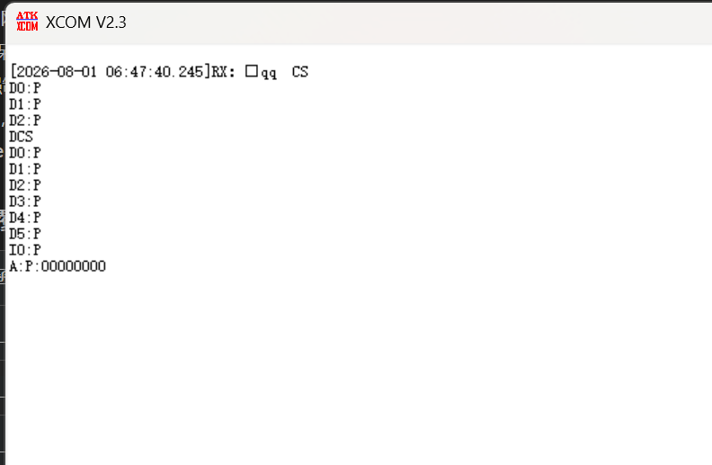

# 在 5pipeline 五级流水线 CPU 中加入 Cache 的完整过程

## 1. 最终实现概览

在原有五级流水线的取指通路和访存通路中分别插入了一个 Cache：

```text
取指通路：PC -> inst_ram（取指事务管理）-> I-Cache -> IRAM
                         |                    |
                         +-> IF 暂停请求      +-> miss 时访问 IRAM

数据通路：EX/MEM -> mem（访存事务及字节处理）-> D-Cache -> DRAM
                              |                    |
                              +-> MEM 暂停请求     +-> miss/写操作访问 DRAM
```

两个 Cache 的结构相同部分如下：


| 项目         |                   I-Cache |                       D-Cache |
| ------------ | ------------------------: | ----------------------------: |
| 组数         |                        32 |                            32 |
| 相联度       |                      2 路 |                          2 路 |
| 每行数据     |       1 个 32 位字（4 B） |           1 个 32 位字（4 B） |
| 总数据容量   |    32 × 2 × 4 B = 256 B |        32 × 2 × 4 B = 256 B |
| 替换算法     | 每组 1 bit 的精确二路 LRU |     每组 1 bit 的精确二路 LRU |
| 写策略       |                      只读 |       写直达（write-through） |
| 写未命中策略 |                    不适用 | 写不分配（no-write-allocate） |
| 有效位清除   |                 `rst_n=0` |                     `rst_n=0` |

当前下级存储器是由 Verilog 数组推断出的片上 `iram`/`dram`，源码注释中有些地方沿用了“DDR”的叫法。对 Cache 接口来说二者没有区别，本文统一称为“下级 RAM”。

每个cache都采用先锁存数据，再在后面的状态机发送

注：dcache的写策略是在写数据hit时更新dram中的数据，同时存入dram。而miss时直接store到dram，不更新dcache。（write through+no write allocate）

## 2. 第一步：确定插入位置和模块边界

### 2.1 I-Cache 的插入位置

原取指模块已经有 PC、取指等待和流水线暂停逻辑，因此没有让 I-Cache 直接操作 PC，而是在 `inst_ram` 和 `iram` 之间插入 I-Cache：

```text
if_stage
├── mux_pc       ：从 PC+4、stall 保持、redirect_pc 中选择 next_pc
├── pc_reg       ：保存 curr_pc
├── inst_ram     ：锁存 PC，发起一次取指，等待并保存指令
├── icache       ：查 tag，命中返回；未命中访问 IRAM 并填充
└── iram         ：下级指令 RAM
```

这样划分后：

- `inst_ram` 负责“这条取指请求是否仍属于正确控制流”；
- `icache` 只负责“这个地址的数据是否在 Cache 中”；
- `iram` 只负责在握手后读出一个 32 位字。

### 2.2 D-Cache 的插入位置

D-Cache 放在 `mem` 和 `dram` 之间：

```text
mem_stage
├── mem          ：把 LB/LH/LW、SB/SH/SW 转换为 32 位请求和字节写使能
├── dcache       ：load 查找/填充，store 写直达并维护命中行
└── dram         ：下级数据 RAM，按 wstrb 更新字节
```

`mem` 仍然负责 RISC-V 指令语义，例如有符号扩展、无符号扩展、地址低两位选字节，以及生成 `wstrb`；D-Cache 只处理一个对齐后的 32 位 Cache 字及其 4 bit 字节写使能。

## 3. 第二步：定义 ready/valid 接口

两个 Cache 都使用单请求、单响应的 ready/valid 协议。

请求只在req_valid和req_ready同时为1时才有效

`valid` 表示发送方当前给出了有效请求，`ready` 表示接收方当前能接收。只有二者同周期为 1，发送方才可以认为请求已经发出。响应侧目前只有 `rsp_valid`，没有 `rsp_ready`，所以接收方必须在响应出现的周期接收数据。

### 3.1 I-Cache 上游接口：`inst_ram <-> icache`


| 信号           | 相对`icache` 方向 | 位宽 | 含义                 | 当前映射                                 |
| -------------- | ----------------- | ---: | -------------------- | ---------------------------------------- |
| `clk`          | 输入              |    1 | 系统时钟             | 所有状态和数组写入在上升沿更新           |
| `rst_n`        | 输入              |    1 | 低有效复位           | 清空状态、valid 和 LRU                   |
| `if_req_valid` | 输入              |    1 | IF 给出有效取指请求  | `inst_ram` 处于 `IF_REQ` 且没有 redirect |
| `if_req_ready` | 输出              |    1 | I-Cache 可以接收请求 | 仅`IC_IDLE` 为 1                         |
| `if_req_addr`  | 输入              |   32 | 指令字节地址         | 来自`inst_ram.if_req_addr`               |
| `if_rsp_valid` | 输出              |    1 | 返回指令有效         | 仅`IC_RESP` 为 1                         |
| `if_rsp_rdata` | 输出              |   32 | 返回的指令字         | 来自锁存器`store_data`                   |

### 3.2 I-Cache 下游接口：`icache <-> iram`


| 信号               | 相对`icache` 方向 | 位宽 | 含义                    |
| ------------------ | ----------------- | ---: | ----------------------- |
| `icache_req_valid` | 输出              |    1 | miss 后向 IRAM 发读请求 |
| `icache_req_ready` | 输入              |    1 | IRAM 当前可接收请求     |
| `icache_req_addr`  | 输出              |   32 | 锁存后的原始字节地址    |
| `icache_rsp_valid` | 输入              |    1 | IRAM 返回数据有效       |
| `icache_rsp_rdata` | 输入              |   32 | IRAM 返回的指令字       |

IRAM 使用 `icache_req_addr[IRAM_AW+1:2]` 把字节地址转换为 RAM 数组的字地址，因此地址低两位不会参与数组索引。

### 3.3 D-Cache 上游接口：`mem <-> dcache`


| 信号            | 相对`dcache` 方向 | 位宽 | 含义                         | 当前映射                            |
| --------------- | ----------------- | ---: | ---------------------------- | ----------------------------------- |
| `mem_req_valid` | 输入              |    1 | MEM 发出 load/store 请求     | `mem` 的状态为 `MEM_REQ`            |
| `mem_req_ready` | 输出              |    1 | D-Cache 可以接收新请求       | 仅`DC_IDLE` 为 1                    |
| `mem_req_addr`  | 输入              |   32 | load/store 字节地址          | EX 级 ALU 计算结果                  |
| `mem_req_wdata` | 输入              |   32 | 已按地址低两位摆放好的写数据 | 例如 SB 到 offset 2 时放在`[23:16]` |
| `mem_req_wstrb` | 输入              |    4 | 4 个字节通道的写使能         | `0001/0010/0100/1000` 等            |
| `mem_req_write` | 输入              |    1 | 0=load，1=store              | 来自`mem_we_i`                      |
| `mem_rsp_valid` | 输出              |    1 | 本次 load/store 已完成       | 仅`DC_RESP` 为 1                    |
| `mem_rsp_rdata` | 输出              |   32 | load 返回的整个 32 位字      | store 时固定返回 0                  |

### 3.4 D-Cache 下游接口：`dcache <-> dram`


| 信号               | 相对`dcache` 方向 | 位宽 | 含义                              |
| ------------------ | ----------------- | ---: | --------------------------------- |
| `dcache_req_valid` | 输出              |    1 | load miss 或任意 store 的下级请求 |
| `dcache_req_ready` | 输入              |    1 | DRAM 可以接收请求                 |
| `dcache_req_addr`  | 输出              |   32 | 锁存后的字节地址                  |
| `dcache_req_wdata` | 输出              |   32 | store 写数据，load 时为 0         |
| `dcache_req_wstrb` | 输出              |    4 | store 字节写使能，load 时为`0000` |
| `dcache_req_write` | 输出              |    1 | 0=读，1=写                        |
| `dcache_rsp_valid` | 输入              |    1 | DRAM 读或写事务完成               |
| `dcache_rsp_rdata` | 输入              |   32 | DRAM 读数据；写响应时不使用       |

## 4. 第三步：地址到组、Tag 和字节的映射

Cache 行只有一个 32 位字，所以 32 位字节地址按下面方式拆分：

```text
31                         7 6             2 1       0
+---------------------------+---------------+---------+
|         Tag[24:0]         |  Index[4:0]   | ByteOff |
+---------------------------+---------------+---------+
            25 bit                5 bit        2 bit
```

RTL 中的直接实现是：

```verilog
assign index = store_addr[6:2];
assign tag   = store_addr[31:7];
```

- `addr[1:0]`：32 位字内的字节偏移。Cache 查找以整个字为单位，因此它不参与 tag/index 比较；MEM 级用它完成 LB/LBU/LH/LHU 和 SB/SH 的选择。
- `addr[6:2]`：5 bit 组索引，可表示 32 组。
- `addr[31:7]`：25 bit Tag，用于区分落在同一组的不同内存地址。

每一路覆盖 `32 × 4 B = 128 B`，所以相差 `0x80` 的字地址具有相同的 index、不同的 tag：


|         地址 |         Tag | Index | Byte offset | 结果           |
| -----------: | ----------: | ----: | ----------: | -------------- |
| `0x00000000` | `0x0000000` |     0 |           0 | set 0          |
| `0x00000004` | `0x0000000` |     1 |           0 | set 1          |
| `0x0000007C` | `0x0000000` |    31 |           0 | set 31         |
| `0x00000080` | `0x0000001` |     0 |           0 | 再次映射 set 0 |
| `0x00000100` | `0x0000002` |     0 |           0 | 再次映射 set 0 |

对一个 128 B 对齐的基地址 `B`，C 数组 `cache_words[n]` 的地址为 `B + 4n`，因此：

```text
set(cache_words[n]) = n mod 32
```

所以测试程序中的 `cache_words[0]`、`cache_words[32]`、`cache_words[64]` 一定映射到同一组，但 tag 不同。这正好可以制造三条数据争用两路 Cache 的场景。

## 5. 第四步：实现 Tag、Data、Valid 和命中判断

每个 Cache 都有两套 data、tag、valid 数组：

```verilog
reg [31:0] data_way0 [0:31];
reg [31:0] data_way1 [0:31];
reg        valid_way0[0:31];
reg        valid_way1[0:31];
reg [24:0] tag_way0  [0:31];
reg [24:0] tag_way1  [0:31];
```

命中不能只比较 tag，还必须检查 valid：

```verilog
assign hit_way0 = valid_way0[index] && (tag_way0[index] == tag);
assign hit_way1 = valid_way1[index] && (tag_way1[index] == tag);
assign miss = !hit_way0 && !hit_way1 && (state == LOOKUP);
```

复位时只需要清零 valid 和 LRU，不必清零所有 data/tag。无效行的数据即使是 `X` 或旧值，也不会被当成命中数据使用，这可以减少无意义的复位逻辑。

上游请求在 `IDLE` 握手时先锁存到 `store_addr`，之后所有 tag/index 判断都使用这个锁存地址。这样即使上游在握手后立即改变地址，当前事务也不会被破坏。D-Cache 还同时锁存 `store_write`、`store_wstrb` 和 store 数据。

## 6. 第五步：实现 I-Cache 状态机

I-Cache 有四个状态：


| 状态          | 作用                      | 退出条件                                                     |
| ------------- | ------------------------- | ------------------------------------------------------------ |
| `IC_IDLE`     | 等待并锁存 IF 地址        | `if_req_valid && if_req_ready`                               |
| `IC_LOOKUP`   | 比较两路 tag              | 命中进入`IC_RESP`；miss 且 IRAM 接收请求后进入 `IC_RAM_WAIT` |
| `IC_RAM_WAIT` | 等待 IRAM 返回            | `icache_rsp_valid`                                           |
| `IC_RESP`     | 向`inst_ram` 给出有效指令 | 下一拍回`IC_IDLE`                                            |

命中流程：

```text
IC_IDLE --锁存地址--> IC_LOOKUP --way0/way1 hit--> IC_RESP --> IC_IDLE
```

未命中流程：

```text
IC_IDLE -> IC_LOOKUP --与 IRAM 请求握手--> IC_RAM_WAIT
        -> 收到 IRAM 响应并填充 victim way -> IC_RESP -> IC_IDLE
```

命中时把对应路数据写入 `store_data`；miss 返回时先把 RAM 数据放入 `store_data`，同时写入 victim 路（根据lru，结合每路是否有数据而选择的路）的 data/tag/valid。`if_rsp_rdata` 始终连接 `store_data`，而 `if_rsp_valid` 只在 `IC_RESP` 拉高，所以上游不会提前采样未更新的数据。

## 7. 第六步：实现 D-Cache 的读写策略

### 7.1 Load 命中

Load 命中时不访问 DRAM：

```text
DC_IDLE -> DC_LOOKUP(hit) -> DC_RESP -> DC_IDLE
```

`store_data` 从命中的 way 取数，同时更新本组 LRU。随后 `mem_rsp_rdata=store_data`，MEM 级再依据原地址低两位进行字节/半字选择和符号扩展。

### 7.2 Load 未命中

Load miss 时选择 victim，向 DRAM 发读请求并锁存 `victim_way_q`。锁存 victim 很重要：等待 RAM 的若干周期内不能再次用组合逻辑重新选择替换路。

DRAM 返回时：

1. 把 `dcache_rsp_rdata` 保存到 `store_data`，用于返回上游；
2. 写入 `data_wayX[index]`；
3. 写入 `tag_wayX[index]`；
4. 置 `valid_wayX[index]=1`；
5. 把刚填充的路标为最近使用，另一条路成为下次 victim。

这就是 read-allocate。

### 7.3 Store 命中：写直达并更新 Cache

所有 store，无论命中还是未命中，都会发送到 DRAM：

```verilog
assign dcache_req_valid =
    (state == DC_LOOKUP) && (store_write || miss);
```

如果 store 命中，必须在下级写事务完成时同步更新命中的 Cache 行，否则下一次 load 会读到 Cache 中的旧值。更新时按 `store_wstrb` 合并字节：

```verilog
if (store_wstrb[0]) data_way0[index][ 7: 0] <= store_data[ 7: 0];
if (store_wstrb[1]) data_way0[index][15: 8] <= store_data[15: 8];
if (store_wstrb[2]) data_way0[index][23:16] <= store_data[23:16];
if (store_wstrb[3]) data_way0[index][31:24] <= store_data[31:24];
```

Cache 和 DRAM 都按相同 `wstrb` 更新，因此 SB、SH 不会破坏同一字中的其他字节。

### 7.4 Store 未命中：写不分配

如果两路都不命中，store 仍然写 DRAM，但不改 data/tag/valid/LRU。以后第一次 load 同一地址时仍会 miss，再从 DRAM 读回并分配 Cache 行。

选择这个策略后不需要为一次 store miss 先读整行，也不需要 dirty bit。代价是“写完立刻读”会多一次读 miss。

## 8. 第七步：二路 LRU 替换策略

每一组只有一个 `lru[index]`：

```text
lru[index] = 0：way0 是最久未使用，下次替换 way0
lru[index] = 1：way1 是最久未使用，下次替换 way1
```

victim 选择优先使用无效路，只有两路都有效时才看 LRU：

```verilog
assign victim_way = !valid_way0[index] ? 1'b0 :
                    !valid_way1[index] ? 1'b1 :
                    lru[index];
```

更新规则为：


| 事件                   | 更新后的`lru[index]` | 含义                       |
| ---------------------- | -------------------: | -------------------------- |
| way0 命中              |                    1 | way0 刚使用，下次淘汰 way1 |
| way1 命中              |                    0 | way1 刚使用，下次淘汰 way0 |
| miss 填入 way0         |                    1 | 新 way0 为最近使用的一路   |
| miss 填入 way1         |                    0 | 新 way1 为最近使用的一路   |
| D-Cache store hit way0 |                    1 | 写命中也算使用 way0        |
| D-Cache store hit way1 |                    0 | 写命中也算使用 way1        |
| D-Cache store miss     |                 不变 | 没有分配任何行             |

## 9. 第八步：让 Cache miss 与流水线暂停配合

### 9.1 IF 侧暂停

`inst_ram` 自己维护 `IF_IDLE/IF_REQ/IF_WAIT/IF_HOLD` 四态事务。在尚未获得一条可供 IF/ID 接收的指令时，它通过 `if_req_o` 请求暂停：

```verilog
assign if_req_o = rst_n &&
    (state == IF_IDLE || state == IF_REQ || state == IF_WAIT || !fetch_enable_i);
```

`Ctrl` 收到 `if_req` 后设置：

```verilog
stall = 6'b000001;
```

只暂停 PC/IF，不暂停 IF/ID，避免 IF/ID 中上一条有效指令被重复执行。当 `inst_ram` 进入 `IF_HOLD` 后，`if_req_o` 解除；`inst_valid_o` 拉高，指令和对应的 `curr_pc_d1` 被 IF/ID 接收。

### 9.2 MEM 侧暂停

`mem` 的事务状态为 `MEM_IDLE/MEM_REQ/MEM_WAIT/MEM_HOLD`。只要当前 load/store 尚未到 `MEM_HOLD`，`mem_req_o` 就请求暂停流水线。`Ctrl` 对它的处理优先级最高（仅低于 loader/异常）：

```verilog
stall = 6'b011111;
```

这会保持从 PC 到 EX/MEM 的相关级，直到 D-Cache 给出响应。`MEM_HOLD` 中数据已经稳定，`mem_accept_i=!stall[4]` 允许 MEM/WB 接收结果，然后事务回到空闲。

### 9.3 控制优先级

当前 `Ctrl` 的主要优先级是：

```text
reset -> loader stall -> exception -> MEM request -> redirect
      -> EX request -> ID request -> IF request
```

因此 I-Cache 等待不会挡住 redirect；`mux_pc` 内部也明确让 `redirect_i` 优先于 `stall_i`，保证分支目标 PC 能写入。MEM 请求的优先级高于 redirect，这是当前实现的既定行为：遇到更老的访存事务时先保持流水线，EX 中的 redirect 信号会随被保持的指令继续存在，访存完成后再执行冲刷。

## 10. 第九步：I-Cache 遇到分支和跳转时的处理

严格来说，I-Cache 不会“发现”分支。`beq/bne/jal/jalr` 在 ID 级译码，在 EX 级完成条件判断和目标地址计算，随后产生：

```text
redirect_i    ：本周期确认改变控制流
redirect_pc_i ：正确的目标 PC
```

I-Cache 只看到地址请求，不理解指令语义。错误路径管理由 `mux_pc`、`Ctrl` 和 `inst_ram` 共同完成：

1. `mux_pc` 令 `next_pc=redirect_pc_i`，且 redirect 优先于 stall。
2. `Ctrl` 冲刷 IF/ID 和 ID/EX，把已经进入流水线的错误路径指令变为 NOP/invalid。
3. `inst_ram` 根据 redirect 发生时所处的取指状态，取消或丢弃旧取指。

### 10.1 redirect 发生在 `IF_IDLE`

`start_fetch` 要求 `!redirect_i`，所以本周期不会用旧 `curr_pc` 启动请求。时钟沿后 PC 已经改为目标地址，之后从目标地址重新取指。

### 10.2 redirect 发生在 `IF_REQ`，请求尚未握手

```verilog
assign if_req_valid = (state == IF_REQ) && !redirect_i;
```

redirect 会立刻撤销 valid，旧地址不会被 I-Cache 接收；状态机回到 `IF_IDLE`。

### 10.3 redirect 发生在 `IF_WAIT`，旧请求已经握手

请求一旦被 I-Cache 接收，就不能简单撤回，因为 I-Cache/IRAM 之后仍会返回响应。因此 `inst_ram` 设置 `discard_q=1`，等旧响应到达后不写 `inst_o`，直接回 `IF_IDLE`。

若 redirect 与 `if_rsp_valid` 恰好同周期出现，逻辑同样通过 `redirect_i` 阻止保存响应，不依赖 `discard_q` 晚一拍生效。

### 10.4 redirect 发生在 `IF_HOLD`

即使旧指令已经准备好：

```verilog
assign inst_valid_o = (state == IF_HOLD) && !redirect_i;
```

redirect 也会把它标成无效，并让状态机回到 `IF_IDLE`，所以错误指令不会进入 IF/ID。

### 10.5 diacard在inst_ram模块里面

`discard_q` 位于 `inst_ram`，不会取消 I-Cache 内部的 miss fill。旧路径的指令可能仍被装入 I-Cache，但不会作为有效指令送入流水线，在inst_ram模块中会因discard信号拉高而被丢掉。指令读取没有副作用，IRAM 在程序运行期间又是只读的，因此这个行为在架构上安全，相当于一次无害的预取。

这种处理还避免了给 Cache 和 RAM 接口增加 cancel 信号。代价是目标路径必须等旧请求自然结束后才能发起，跳转 miss 延迟会稍长。

## 11. C 测试程序设计

完整程序见 [`cache_test.c`](cache_test.c)。它是 RV32I 裸机程序，不依赖 C 运行库，通过 MMIO 地址 `0x1000_0000` 输出测试结果。

### 11.1 为什么数组要 128 B 对齐

```c
static volatile cache_word_t cache_words[96]
    __attribute__((aligned(128), section(".bss.cache_test")));
```

- 96 个 word 刚好提供 3 个 tag × 32 个 组，cache中32组，每组2路；
- 128 B 对齐保证第 0 个元素落在 set 0；
- `volatile` 强制程序真正执行每次 load/store；
- 程序用 store 初始化，不需要携带大块 DMEM 初值；
- 初始化 store 全部是 write-no-allocate，不会提前污染后续要测试的 D-Cache 行。

### 11.2 每个测试覆盖什么


| 输出 | 测试函数                             | 覆盖内容                  | 关键预期                                               |
| ---- | ------------------------------------ | ------------------------- | ------------------------------------------------------ |
| `D0` | `test_repeated_load`                 | 冷 miss 后重复读          | 第一次 miss，第二次 hit，数据一致                      |
| `D1` | `test_all_sets`                      | 遍历全部 32 组            | 第一遍填充，第二遍命中                                 |
| `D2` | `test_two_way_lru`                   | 两路及 LRU                | 同组 A/B/C 按`M H H M H M` 演进                        |
| `D3` | `test_write_hit`                     | 写命中                    | Cache 和 DRAM 都变为`0xCAFEBABE`                       |
| `D4` | `test_no_write_allocate`             | 写未命中                  | 下级事务应为 W、R；第二次 load hit                     |
| `D5` | `test_write_masks_and_write_through` | SB/SH、写直达、替换后重读 | 最终逐字节组合成`0x24EF1357`，淘汰后从 DRAM 仍读到该值 |
| `I0` | `test_icache_two_way_lru`            | I-Cache 两路和 LRU        | 调用 A/B/A/C/A/B，最终计算值`0xAB`                     |

`I0` 把三个小函数分别放在 128 B 对齐的 section 中，使函数入口映射到同一 I-Cache set、不同 tag：

```c
__attribute__((aligned(128), section(".text.icache_a")))
__attribute__((aligned(128), section(".text.icache_b")))
__attribute__((aligned(128), section(".text.icache_c")))
```

函数返回值可以验证功能正确，但单看 UART 的 `I0:P` 不能证明每一次预期访问确实 hit/miss；精确的替换次序还要结合波形中的 `state/index/tag/hit_way*/victim_way_q` 检查。

### 11.3 D-Cache 六个测试的源代码

下面是 `cache_test.c` 中 D0～D5 六个 D-Cache 测试函数：

```c
/* D0: one cold load followed by a hit to the exact same word. */
static NOINLINE uint32_t test_repeated_load(void)
{
    //连续load同一地址的数据
    uint32_t first  = cache_words[1].w;//第一次读取：D-Cache miss，从 DRAM 读取
    uint32_t second = cache_words[1].w;//第二次读取：D-Cache hit，直接从 Cache 读取

    return (first == initial_value(1u)) && (second == first);
}

/* D1: cover all 32 indices, then repeat the same sweep as hits. */
static NOINLINE uint32_t test_all_sets(void)
{
    //32 个 word 分别映射到 D-Cache 的 32 个组，正常情况下第一次都 miss
    //第二遍正常情况下应该全部 hit
    uint32_t i;
    uint32_t expected = 0u;
    uint32_t first_sum = 0u;
    uint32_t second_sum = 0u;

    for (i = 32u; i < 64u; ++i) {
        expected += initial_value(i);
        first_sum += cache_words[i].w;
    }

    compiler_barrier();

    for (i = 32u; i < 64u; ++i)
        second_sum += cache_words[i].w;

    return (first_sum == expected) && (second_sum == expected);
}

//在D1中32个组的一路被装过一个字了
/*
 * D2: exercise both ways and LRU in set 0.
 * A/B/C are 0x80 bytes apart, hence have the same index.
 * Expected read miss/hit sequence after D1 is: M H H M H M.
 */
static NOINLINE uint32_t test_two_way_lru(void)
{
    //测试两路和LRU
    uint32_t value;
    uint32_t pass = 1u;

    value = cache_words[0].w;   /* A: miss, fill the second way. */
    pass &= (value == initial_value(0u));
    value = cache_words[32].w;  /* B: hit.  D1的时候装过cache了，所以hit*/
    pass &= (value == initial_value(32u));
    value = cache_words[0].w;   /* A: hit; B becomes LRU. */
    pass &= (value == initial_value(0u));
    value = cache_words[64].w;  /* C: miss; replace B. */
    pass &= (value == initial_value(64u));
    value = cache_words[0].w;   /* A must still hit. */
    pass &= (value == initial_value(0u));
    value = cache_words[32].w;  /* B: miss and refill. */
    pass &= (value == initial_value(32u));

    return pass;
}

/* D3: a store hit must update both the cached word and DRAM. */
static NOINLINE uint32_t test_write_hit(void)
{
    uint32_t before = cache_words[2].w; /* First load fills the line. */

    cache_words[2].w = 0xCAFEBABEu;//store时命中了应该更新cache
    compiler_barrier();

    return (before == initial_value(2u)) &&
           (cache_words[2].w == 0xCAFEBABEu);
}

/*
 * D4: a store miss must write DRAM without allocating a cache line.
 * In a waveform, the expected downstream transaction order is W, R; the
 * second load must then hit and create no third downstream transaction.
 */
static NOINLINE uint32_t test_no_write_allocate(void)
{
    uint32_t first;
    uint32_t second;

    //D0D1把这组装满了，way0：cache_words[1] way1：cache_words[33]
    cache_words[65].w = 0x0BADC0DEu;//store miss，cache不变（store miss指的是tag不一样）
    compiler_barrier();
    first = cache_words[65].w;//load miss
    second = cache_words[65].w;//load hit

    return (first == 0x0BADC0DEu) && (second == first);
}

/*
 * D5: verify SB/SH byte enables, cache update on a write hit, and write-through.
 * The final two congruent loads evict word 66; reloading it checks DRAM data.
 */
//sb，sh指令测试
static NOINLINE uint32_t test_write_masks_and_write_through(void)
{
    uint32_t value;
    uint32_t pass = 1u;

    value = cache_words[66].w;
    pass &= (value == initial_value(66u));

    cache_words[66].b[1] = 0xAAu;
    pass &= (cache_words[66].w == 0xA500AA42u);

    cache_words[66].h[1] = 0xBEEFu;
    pass &= (cache_words[66].w == 0xBEEFAA42u);

    cache_words[66].h[0] = 0x1357u;
    pass &= (cache_words[66].w == 0xBEEF1357u);

    cache_words[66].b[3] = 0x24u;
    pass &= (cache_words[66].w == 0x24EF1357u);

    /* Touch the other two tags of set 2 to evict word 66. */
    value = cache_words[2].w;
    pass &= (value == 0xCAFEBABEu);
    value = cache_words[34].w;
    pass &= (value == initial_value(34u));

    /* This must miss and obtain the write-through result from DRAM. */
    value = cache_words[66].w;
    pass &= (value == 0x24EF1357u);

    return pass;
}
```

### 11.4 预期 UART 输出

全部通过时调试串口应输出：

```text
CS
D0:P
D1:P
D2:P
D3:P
D4:P
D5:P
I0:P
A:P:00000000
```

最后一行中间的 `P` 表示总结果通过，末尾 8 位十六进制数是失败测试数量。



*图：开发板实测串口输出。完整一轮测试中 `D0`～`D5` 和 `I0` 均返回 `P`，最终 `A:P:00000000` 表示全部测试通过，失败数量为 0。*

## 12. 编译、生成镜像和下载

编译，下载部分与之前相同

## 13. 仿真和波形检查建议

tb仿真时删去差分时钟模块

建议至少加入下列波形：

```text
# I-Cache
u_if_stage/u_inst_ram/state
u_if_stage/u_inst_ram/discard_q
u_if_stage/u_icache/state
u_if_stage/u_icache/store_addr
u_if_stage/u_icache/index
u_if_stage/u_icache/tag
u_if_stage/u_icache/hit_way0
u_if_stage/u_icache/hit_way1
u_if_stage/u_icache/miss
u_if_stage/u_icache/victim_way_q

# D-Cache
u_mem_stage/u_mem/state
u_mem_stage/u_dcache/state
u_mem_stage/u_dcache/store_addr
u_mem_stage/u_dcache/store_write
u_mem_stage/u_dcache/store_wstrb
u_mem_stage/u_dcache/index
u_mem_stage/u_dcache/tag
u_mem_stage/u_dcache/hit_way0
u_mem_stage/u_dcache/hit_way1
u_mem_stage/u_dcache/miss
u_mem_stage/u_dcache/victim_way_q

# 流水线控制
redirect
redirect_pc
stall
flush_if_id
flush_id_ex
if_req
mem_req
```

验证时不要只看最终寄存器或 UART。重点检查：请求地址是否在握手时锁存、miss 请求是否只握手一次、RAM 响应时 victim 是否保持不变、部分写是否只改变 `wstrb` 指定的字节，以及 redirect 后旧 `if_rsp_rdata` 是否没有伴随 `inst_valid_o` 进入 IF/ID。

## 14. 源代码附件索引

以下均为本文所描述的当前源码，Markdown 与源码放在同一个 `5pipeline` 目录下，可直接点击查看完整实现：


| 类别             | 文件                                             | 作用                                        |
| ---------------- | ------------------------------------------------ | ------------------------------------------- |
| I-Cache 核心     | [`if/icache.v`](if/icache.v)                     | 两路查找、miss refill、LRU                  |
| I-Cache 集成     | [`if/if_stage.v`](if/if_stage.v)                 | 连接 PC、`inst_ram`、I-Cache 和 IRAM        |
| 分支期间取指管理 | [`if/inst_ram.v`](if/inst_ram.v)                 | 请求锁存、暂停、`discard_q`                 |
| 下级指令 RAM     | [`if/iram.v`](if/iram.v)                         | I-Cache miss 响应及 Loader 写入             |
| PC 重定向        | [`if/mux_pc.v`](if/mux_pc.v)                     | redirect > stall > PC+4                     |
| D-Cache 核心     | [`mem_stage/dcache.v`](mem_stage/dcache.v)       | 两路读 Cache、写直达、写不分配、LRU         |
| D-Cache 集成     | [`mem_stage/mem_stage.v`](mem_stage/mem_stage.v) | 连接 MEM、D-Cache 和 DRAM                   |
| Load/store 适配  | [`mem_stage/mem.v`](mem_stage/mem.v)             | 地址低位、符号扩展、`wstrb`、MEM stall      |
| 下级数据 RAM     | [`mem_stage/dram.v`](mem_stage/dram.v)           | 32 位读和逐字节写                           |
| 流水线控制       | [`Ctrl.v`](Ctrl.v)                               | Cache 等待对应的 stall，以及 redirect flush |
| 顶层连接         | [`cpu_top.v`](cpu_top.v)                         | IF/MEM/Loader/调试串口的最终接线            |
| C 测试源程序     | [`cache_test.c`](cache_test.c)                   | D0～D5、I0 和 UART 汇总                     |
| 测试平台         | [`testbench_cpu_top.sv`](testbench_cpu_top.sv)   | 通过 UART Loader 发送两个镜像               |

完整 RTL 和 C 程序保留为独立附件，而本文给出接口、映射与关键代码段。这样后续修改源码时，可以直接以对应 `.v/.c` 文件为唯一真实版本，避免 Markdown 内复制出的几百行代码与工程实现不一致。
