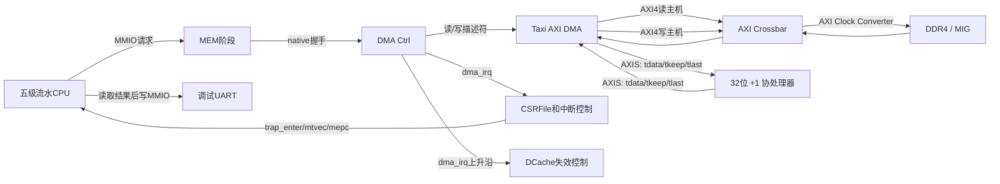

# DMA、协处理器与中断实现说明

本文档说明  SoC 中 DMA 搬运、AXI-Stream `+1` 协处理器、RISC-V 机器外部中断以及 DCache 一致性处理的实现思路。内容以当前工程 RTL 和已经通过的上板测试为准。

## 1. 设计目标

系统完成以下任务：

1. Loader 预先把程序和源数据下载到 DDR。
2. CPU 通过 MMIO 寄存器配置 DMA 的源地址、目的地址和字节长度。
3. DMA 通过 AXI4 从 DDR 读取数据。
4. DMA 把读出的数据转换成 AXI-Stream 数据流。
5. `+1` 协处理器对每个 32 位数据执行加一。
6. DMA 接收处理后的 AXI-Stream 数据，并通过 AXI4 写回 DDR。
7. 写回完成后，DMA 产生机器外部中断。
8. CPU 进入中断处理函数，清除中断并通过 `mret` 返回。
9. CPU 读取 DDR 中的结果，通过调试 UART 打印。

当前上板测试一次处理 16 个 32 位数据，即 64 字节，最终输出：

```text
IRQ count: 1
DMA TEST PASS
```

## 2. 总体数据通路



需要区分三类接口：

| 接口            | 用途                                     | 是否带地址 |
| --------------- | ---------------------------------------- | ---------- |
| CPU native MMIO | CPU配置和读取 DMA 控制寄存器             | 是         |
| AXI4            | DMA、ICache、DCache、Loader访问 DDR/UART | 是         |
| AXI-Stream      | DMA与协处理器之间逐拍传输数据            | 否         |

协处理器不需要分配地址，也不是 AXI4 从机。它只处理 DMA 输出的 AXI-Stream 数据流。

## 3. 主要源文件

| 文件                                   | 作用                                          |
| -------------------------------------- | --------------------------------------------- |
| `dma/dma_subsystem_top.sv`           | DMA子系统顶层，连接控制器、Taxi DMA和协处理器 |
| `dma/dma_ctrl.sv`                    | CPU可访问的配置寄存器、描述符控制、状态和IRQ  |
| `dma/taxi_axi_dma.sv`                | Taxi DMA顶层，内部连接读DMA和写DMA            |
| `dma/taxi_axi_dma_rd.sv`             | AXI4 Memory-to-Stream，从DDR读取并输出AXIS    |
| `dma/taxi_axi_dma_wr.sv`             | AXIS-to-Memory，接收AXIS并写回DDR             |
| `dma/3interface/axi.sv`              | Taxi AXI4 SystemVerilog interface定义         |
| `dma/3interface/axis.sv`             | Taxi AXI-Stream interface定义                 |
| `dma/3interface/taxi_dma_desc_if.sv` | Taxi DMA描述符和完成状态接口                  |
| `coprocessor/add.sv`                 | 对每个32位AXIS数据执行加一                    |
| `mem_stage/mem.sv`                   | 识别DMA MMIO地址，并与 `dma_ctrl` 握手      |
| `mem_stage/dcache.sv`                | CPU数据Cache及DMA完成后的全Cache失效          |
| `ex_stage/csr_file.sv`               | `mstatus/mie/mtvec/mepc/mcause/mip` 实现    |
| `ex_stage/ex.sv`                     | CSR指令计算、`mret`跳转和普通EX逻辑         |
| `ex_stage/ex_stage.sv`               | CSRFile例化、CSR前递和中断连接                |
| `soc_top.sv`                         | CPU、DMA、Crossbar、DDR、UART和IRQ的顶层连接  |
| `dma_test.c`                         | 已经上板通过的DMA、中断和UART测试程序         |

工程中的 Taxi 公共模块存在内容相同的副本，例如 `taxi_axi_if`、`taxi_arbiter`、`taxi_penc` 和 `taxi_axi_crossbar_addr`。建立工程文件列表时，同名模块只加入一份，避免重复定义。

## 4. 地址空间与地址转换

### 4.1 CPU地址和DMA物理地址

当前软件和硬件使用两套 DDR 地址：

```text
CPU访问DDR的地址窗口：0x8000_0000开始
DMA访问Crossbar的物理地址：0x1000_0000开始
```

转换关系为：

```text
dma_phys = cpu_addr - 0x8000_0000 + 0x1000_0000
```

例如：

```text
CPU看到的数组地址：0x8000_0200
DMA描述符中的地址：0x1000_0200
```

CPU程序中的 `dma_src` 和 `dma_dst` 是 CPU 地址；写入 DMA `SRC/DST` 寄存器前必须转换成 DMA 能直接送到 AXI Crossbar 的物理地址。

### 4.2 DMA寄存器地址

DMA控制器使用以下 CPU MMIO 地址：

|            地址 | 名称              | 属性 | 含义                            |
| --------------: | ----------------- | ---- | ------------------------------- |
| `0x4000_1000` | `DMA_SRC`       | RW   | DDR源物理地址                   |
| `0x4000_1004` | `DMA_DST`       | RW   | DDR目的物理地址                 |
| `0x4000_1008` | `DMA_LEN`       | RW   | 传输总字节数                    |
| `0x4000_100C` | `DMA_CONTROL`   | W    | bit0=`START`，bit1=`IRQ_EN` |
| `0x4000_1010` | `DMA_STATUS`    | R    | busy/done/error/irq_pending     |
| `0x4000_1014` | `DMA_IRQ_CLEAR` | W    | 写bit0=1清除IRQ                 |

`DMA_STATUS` 的当前定义：

```text
bit0 busy
bit1 done
bit2 error
bit3 irq_pending
bit31:4 保留
```

CPU使用 `sw` 写配置寄存器，使用 `lw` 读取状态寄存器。`LEN` 的单位是字节，不是32位字数。

例如处理16个32位数：

```text
DMA_LEN = 16 × 4 = 64字节
```

## 5. CPU如何配置DMA

CPU执行普通 Store 指令访问 MMIO。`mem_stage/mem.sv` 根据 ALU 计算出的地址识别 `DMA_SRC/DST/LEN/CONTROL/IRQ_CLEAR`，然后通过以下 native 握手接口访问 `dma_ctrl`：

```text
dma_req_valid
dma_req_ready
dma_addr
dma_wdata
dma_wstrb
dma_we
dma_rsp_valid
dma_rdata
```

典型软件配置顺序：

```c
MMIO32(DMA_IRQ_CLEAR_ADDR) = 1u;
MMIO32(DMA_SRC_ADDR)       = src_phys;
MMIO32(DMA_DST_ADDR)       = dst_phys;
MMIO32(DMA_LEN_ADDR)       = byte_len;
MMIO32(DMA_CONTROL_ADDR)   = DMA_CONTROL_START |
                             DMA_CONTROL_IRQ_EN;
```

最后一次写 `DMA_CONTROL.START` 产生一个 `start_pulse`。控制器不会因为 CONTROL bit0 持续为1而重复启动。

CPU不需要在DMA整个运行期间硬件停住流水线。CPU只会在访问MMIO时等待握手；启动后可以继续执行其他指令，也可以像测试程序一样等待中断标志。

## 6. DMA控制器内部逻辑

`dma_ctrl.sv` 内部有两组状态机。

### 6.1 MMIO状态机

```text
IDLE_M：等待CPU请求并锁存地址、数据和读写属性
REQ_M ：区分读请求或写请求
WAIT_M：状态寄存器读取返回
DONE_M：结束当前MMIO事务并回到IDLE
```

写寄存器完成后不需要返回数据；读取 `DMA_STATUS` 时通过 `dma_rsp_valid` 返回 `dma_rdata`。

### 6.2 DMA描述符状态机

```text
IDLE_D：等待START脉冲
REQ_D ：同时向Taxi读DMA和写DMA发送描述符
BACK_D：等待写描述符完成状态
```

读描述符包含：

```text
src_addr = DMA_SRC
len      = DMA_LEN[15:0]
```

写描述符包含：

```text
dst_addr = DMA_DST
len      = DMA_LEN[15:0]
```

读、写描述符的 `valid` 必须保持到各自 `ready` 完成握手。由于两个接口不一定在同一周期握手，`rd_desc_done` 和 `wr_desc_done` 分别记录完成情况。

当前实现以 `wr_desc_sts_valid` 作为整个任务写回完成的标志。完成后：

```text
busy  = 0
done  = 写状态无错误
error = 写状态有错误
```

若 `DMA_CONTROL.IRQ_EN=1`，同时置位 `irq_pending`，并让 `dma_irq` 保持为高，直到CPU写 `DMA_IRQ_CLEAR`。

## 7. Taxi DMA的数据流

`taxi_axi_dma` 内部把读路径和写路径连接起来：

```text
DDR
  │ AXI4 Read
  ▼
taxi_axi_dma_rd
  │ AXI-Stream
  ▼
+1协处理器
  │ AXI-Stream
  ▼
taxi_axi_dma_wr
  │ AXI4 Write
  ▼
DDR
```

当前参数：

```systemverilog
.AXI_MAX_BURST_LEN(16)
.UNALIGNED_EN(1'b1)
```

AXI4地址通道可以发起Burst；数据通道按拍传输。当前数据宽度为32位，所以完整的一拍是4字节。

当长度不是4的整数倍时，最后一拍由 `tkeep/wstrb` 标记有效字节。但当前协处理器对整个32位值直接加一，因此本项目软件约束 `SRC/DST` 4字节对齐并让 `LEN` 是4的整数倍。

## 8. AXI-Stream与协处理器

协处理器使用以下输入握手：

```text
data_i   = tdata[31:0]
keep_i   = tkeep[3:0]
last_i   = tlast
valid_i  = tvalid
ready_i  = tready
```

只有在以下条件同时成立时，一个32位输入数据才真正传入协处理器：

```text
valid_i && ready_i
```

输出同样遵循：

```text
valid_o && ready_o
```

`last` 不是“每32个数据拉高”，而是在当前描述符的最后一个数据拍上拉高。`keep[3:0]` 的每一位表示对应字节是否有效。

`add.sv` 使用三个状态：

```text
IDLE：ready_i=1，接收并锁存data/keep/last
PROC：计算proc_data = store_data + 1
WAIT：valid_o=1，保持输出直到下游ready_o=1
```

在 `WAIT` 状态发生输出握手后，模块才回到 `IDLE` 接收下一个数据，因此支持AXIS背压，不会在DMA写侧忙时丢数据。

当前实现不是一拍一个数据的满流水结构，吞吐率较低，但逻辑简单，已经满足功能验证。如果后续追求性能，可以改成单级寄存器切片或完整流水线，使输入和输出可以连续握手。

## 9. DMA中断实现

### 9.1 中断产生

Taxi写DMA返回：

```text
wr_desc_sts_valid = 1
```

表示写描述符已经完成。`dma_ctrl` 根据写状态更新 `done/error`；当 `IRQ_EN=1` 时：

```text
irq_pending <= 1
dma_irq      = irq_pending
```

这是电平型中断。即使CPU已经进入中断，`dma_irq` 仍保持为1，必须由中断处理函数写 `DMA_IRQ_CLEAR` 清除。

### 9.2 CSR中断判断

DMA IRQ连接到机器外部中断Pending位：

```text
mip.MEIP = dma_irq
```

CPU接受中断需要三个条件同时成立：

```text
mstatus.MIE = 1   全局机器中断使能
mie.MEIE    = 1   机器外部中断使能
mip.MEIP    = 1   DMA外部中断正在请求
```

即：

```systemverilog
irq_request = mstatus[MIE] && mie[MEIE] && mip[MEIP];
```

### 9.3 进入中断

顶层在当前EX指令有效、流水线没有未完成MEM/EX事务和待提交CSR写时产生 `trap_enter`。进入中断时：

1. 保存将被冲刷、之后需要重新执行的 `EX PC` 到 `mepc`。
2. 写 `mcause = 0x8000_000B`，表示Machine External Interrupt。
3. `MPIE <= MIE`，保存进入中断前的全局使能。
4. `MIE <= 0`，防止处理中断时重复进入。
5. PC重定向到 `mtvec`。
6. Ctrl冲刷IF/ID、ID/EX和EX/MEM中尚未提交的年轻指令。

数据提交顺序可以表示为：

```text
WB、MEM中的老指令允许完成
EX及其后的年轻指令被冲刷
mepc保存EX PC
中断返回后从mepc重新执行
```

### 9.4 中断处理与mret

软件中断处理函数执行：

```c
status = MMIO32(DMA_STATUS_ADDR);
MMIO32(DMA_IRQ_CLEAR_ADDR) = 1u;
dma_irq_count += 1u;
dma_irq_done = status & (DONE | ERROR);
```

中断函数结束时执行 `mret`。当前CPU在EX阶段识别 `mret`：

```text
redirect_pc = mepc
MIE         = MPIE
MPIE        = 1
```

然后冲刷流水线并从 `mepc` 恢复执行。`mret` 只有在指令有效且EX能够向后提交时才生效，避免流水线暂停期间重复执行。

工程还对CSR相关冒险进行了处理：CSR新值在WB提交到CSRFile；EX优先使用来自更近流水级的CSR前递值；若 `mret` 前方仍有会修改CSR的指令，ID阶段暂停等待。

## 10. DCache与DDR一致性

### 10.1 问题来源

DMA直接访问DDR，不经过CPU的DCache。例如：

```text
DCache旧值：10
DMA把DDR改成：11
CPU再次读取相同地址
```

如果DCache对应Cache line仍然有效，CPU可能命中旧值10，而不是DDR中的新值11。

### 10.2 当前处理方法

当前DCache是写直达、写不分配结构：CPU Store会写DDR；若Store命中Cache，也同步更新Cache。因此源数据由CPU写入后，只要写事务已经完成再启动DMA，DDR中就有最新源数据。

DMA完成后，DCache执行全失效：

1. 对 `dma_irq` 做上升沿检测，得到一个周期的 `dma_irq_pulse`。
2. 如果DCache正处于 `DC_IDLE`，立即产生 `invalidate_now`。
3. 如果DCache正忙，置位 `invalidate_pending` 保存请求。
4. 等DCache回到 `DC_IDLE` 后，清除全部 `valid_way0/valid_way1`。
5. 失效周期拉低 `mem_req_ready`，不接受新的CPU请求。

清除valid位后无需清除data和tag，因为valid=0时不会命中。

### 10.3 当前限制和推荐改进

当前失效触发源是 `dma_irq`。如果软件启动DMA时没有设置 `IRQ_EN`，DMA完成后不会产生IRQ，DCache也不会失效。

更稳健的改进是让 `dma_ctrl` 单独输出：

```text
dma_done_pulse
```

该脉冲应在写描述符完成时无条件产生：

```text
wr_desc_sts_valid
    ├─ 无条件产生dma_done_pulse → DCache一致性
    └─ IRQ_EN=1时置irq_pending   → CPU中断
```

这样Cache一致性不依赖软件是否开启中断。

当前上板程序在DMA运行前没有读取 `dma_dst`，因此已经证明主数据通路，但还没有严格证明“DCache预先缓存旧目的数据”情况下的失效。专项一致性测试应先让CPU写入并读取 `dma_dst`，故意建立旧Cache副本，再启动DMA并检查最终结果。

## 11. 软件测试流程

当前 `dma_test.c` 的主要流程：

```text
Loader下载.text和.data到DDR
        │
        ▼
CPU设置mtvec、mie.MEIE、mstatus.MIE
        │
        ▼
CPU把dma_src/dma_dst的CPU地址转换成DMA物理地址
        │
        ▼
写SRC、DST、LEN、START|IRQ_EN
        │
        ▼
DMA读DDR → AXIS +1 → DMA写DDR
        │
        ▼
dma_irq拉高，CPU进入中断
        │
        ▼
中断函数读STATUS、写IRQ_CLEAR、设置完成标志
        │
        ▼
mret返回，CPU读取dma_dst并通过UART打印
```

源数组：

```text
00000000 00000001 00000002 00000003
00000010 00000020 00000030 00000040
00000100 00000200 00000300 00000400
12345678 7FFFFFFE 80000000 FFFFFFFE
```

正确结果：

```text
00000001 00000002 00000003 00000004
00000011 00000021 00000031 00000041
00000101 00000201 00000301 00000401
12345679 7FFFFFFF 80000001 FFFFFFFF
```

已完成的上板验证说明CPU、DDR、DMA AXI读写、AXIS协处理器、中断进入/清除/返回和UART输出能够协同工作。

## 12. 当前设计边界

1. 数据宽度固定为32位，测试要求地址4字节对齐、长度是4的整数倍。
2. `dma_ctrl` 只把 `dma_len[15:0]` 送入描述符，单次最大长度受16位描述符长度限制。
3. 当前控制器一次只管理一组SRC/DST/LEN，没有描述符队列。
4. `+1`模块不是满流水结构，吞吐率低于Taxi DMA和DDR的理论峰值。
5. 当前任务完成和错误状态主要依据写描述符状态；`rd_desc_sts_error` 已接入控制器端口但还没有合并到最终 `error`。
6. DCache全失效实现简单可靠，但会丢弃与DMA目的区域无关的Cache内容，降低性能。
7. DCache失效目前依赖IRQ上升沿；推荐改成独立 `dma_done_pulse`。
8. CPU读取结果并格式化为ASCII后写UART。当前没有使用第二次DMA直接把DDR内容发送到UART。

## 13. 推荐的后续验证

### 13.1 DCache旧值专项测试

```text
CPU写dma_dst=DEADBEEF
CPU读取dma_dst，使旧值进入DCache
启动DMA覆盖同一目的区域
等待IRQ
CPU再次读取dma_dst
所有结果仍应为源数据+1
```

### 13.2 边界测试

建议增加：

- 1个32位字。
- 16拍完整AXI Burst。
- 跨Burst边界的长度。
- `0xFFFF_FFFF + 1 = 0x0000_0000` 回绕。
- AXI读响应错误和写响应错误。
- IRQ清除后再次启动第二次DMA。
- DCache正忙时DMA完成，验证 `invalidate_pending` 不丢脉冲。

## 14. 相关开源仓库

### 14.1 本项目DMA和AXI基础：Taxi

- GitHub：[FPGA Ninja Taxi](https://github.com/fpganinja/taxi)
- 项目主页：[Taxi Documentation](https://fpganinja.github.io/taxi/)

Taxi提供SystemVerilog实现的AXI、AXI-Stream、DMA、Crossbar、FIFO、寄存器切片等模块。本项目中的 `taxi_axi_dma*`、`taxi_axi_if`、`taxi_axis_if`、描述符接口以及AXI Crossbar来源于这一体系。使用和分发时应保留源文件中的 SPDX 与版权声明。

### 14.2 Taxi的前身：verilog-axi

- GitHub：[alexforencich/verilog-axi](https://github.com/alexforencich/verilog-axi)

该仓库包含AXI DMA、Crossbar、RAM和适配器等经典实现。仓库目前主要用于已有设计参考，新设计优先使用Taxi。

### 14.3 AXI-Stream组件参考

- GitHub：[alexforencich/verilog-axis](https://github.com/alexforencich/verilog-axis)

该仓库包含AXIS FIFO、异步FIFO、宽度转换、仲裁、广播和流水线寄存器等模块。若后续给 `+1`协处理器增加FIFO、跨时钟域或宽度转换，可参考其中结构。

### 14.4 RISC-V CSR和中断规范

- GitHub：[riscv/riscv-isa-manual](https://github.com/riscv/riscv-isa-manual)

机器模式CSR、`mstatus`、`mie`、`mip`、`mtvec`、`mepc`、`mcause` 和 `mret` 的行为以RISC-V特权架构规范为准。本项目目前实现的是满足DMA机器外部中断所需的最小子集。

### 14.5 RISC-V测试参考

- GitHub：[riscv-software-src/riscv-tests](https://github.com/riscv-software-src/riscv-tests)

可参考该仓库组织CSR、异常和基础指令测试，但本项目的DMA MMIO、中断源和Loader协议仍需使用自己的裸机测试程序。

## 15. 总结

本项目采用“CPU负责配置、DMA负责搬运、AXIS协处理器负责计算、IRQ负责通知”的结构：

```text
控制面：CPU MMIO → dma_ctrl → Taxi描述符
数据面：DDR → AXI DMA读 → AXIS +1 → AXI DMA写 → DDR
通知面：写完成 → dma_irq → CSR/Trap → 中断函数 → mret
一致性：DMA完成 → DCache valid全失效 → CPU重新从DDR读取
```

这种拆分使CPU、DMA和协处理器职责清晰，也便于将 `+1`模块替换成其他流式计算单元。当前系统已经完成一次16字、64字节的端到端上板验证。
